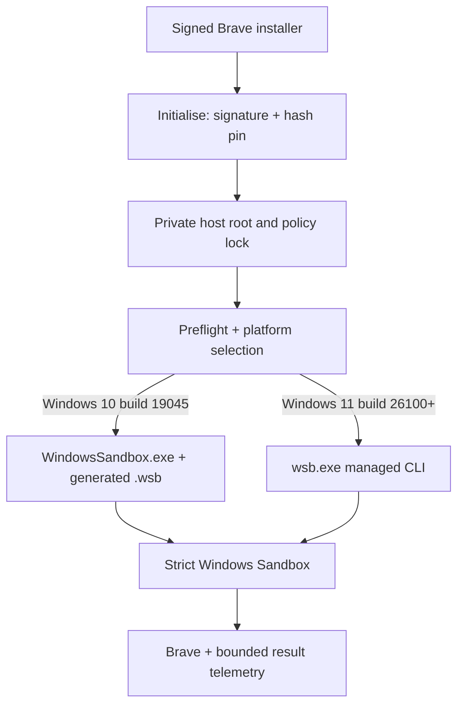

# Airlock Increment 1 Architecture

## Problem and success criteria

Airlock must launch Brave in a disposable Windows environment while preventing ambient
host-file access and capture-device redirection. The approved compatibility change adds
a second host contract: Windows 10 Pro 22H2 build 19045 must work without removing
Windows 11 24H2+ support.

Success is not merely "a window opened." It requires:

1. preflight rejects every unsupported prerequisite with an actionable recovery step;
2. one command selects the correct native lifecycle path for the host;
3. generated XML explicitly disables network, audio, video, clipboard, printer, and
   vGPU, enables ProtectedClient, and bounds memory;
4. only a fresh read-only bootstrap and empty result folder are mapped;
5. Brave executes only after its signature and pinned hash are rechecked in the guest;
6. Windows 11 records a managed Sandbox ID; Windows 10 never invents one and instead
   records guarded native process identity;
7. live acceptance and three-run resource evidence pass before the relevant story is DONE.

## AI decision

No AI or machine-learning component is needed. This is deterministic policy enforcement.
Native rules are cheaper, faster, explainable, and testable. An AI agent in the launch
path would add nondeterminism, latency, data exposure, and attack surface without
improving a binary allow/deny decision.

## Native platform decision

Microsoft supports Windows Sandbox and `.wsb` configuration on Windows 10 and Windows 11.
The newer Store-based runtime and command-line lifecycle are available on Windows 11
24H2+. Airlock therefore reuses the same strict `.wsb` profile and changes only the
lifecycle adapter selected during preflight.

| Host contract | Launch mode | Native entry point | Lifecycle truth |
|---|---|---|---|
| Windows 10 Pro 22H2 build 19045 AMD64 | `legacy-wsb` | `%SystemRoot%\System32\WindowsSandbox.exe <Airlock.wsb>` | PID + executable path + process creation identity; no managed Sandbox ID |
| Windows 11 Pro/Enterprise/Education build 26100+ | `managed-cli` | `%SystemRoot%\System32\wsb.exe` | managed list/start/stop flow and Sandbox ID |

Windows 10 lifecycle control is weaker, but the guest security policy is not weaker.
That distinction is explicit in state and output through `LifecycleControl`.

## Components and data flow



| Component | Responsibility | Trust rule |
|---|---|---|
| `Initialize-Airlock.ps1` | Validate publisher, hash installer, pin package and guest-script hashes | Never downloads or executes the installer |
| `Airlock.Platform.ps1` | Resolve Windows 10/11 contract and legacy process discovery | Pure version/edition/launcher decision; no security downgrade |
| `Start-Airlock.ps1` | Preflight, single-launch mutex, hash recheck, staging, native launch, state record | Starts nothing after any ambiguous prerequisite; never invents an ID |
| `New-AirlockProfile.ps1` | Validate strict policy and safe paths; render escaped XML | Rejects weakened values and broad/reparse mappings |
| `guest/provision.ps1` | Recheck signature/hash, install Brave, launch it, emit bounded result JSON | Reads only bootstrap; writes only result folder |
| `policy.json` | Reviewable strict template | Package fields stay unusable until signed initialisation |

There is no database, HTTP API, cloud service, authentication system, model server, or
web UI in this local slice. PowerShell is the user interface, JSON is the local contract,
and the Windows Sandbox runtime is the platform boundary.

## Host layout

```text
%LOCALAPPDATA%\Airlock\
  packages\<sha256>\BraveBrowserStandaloneSilentSetup.exe
  policy.lock.json
  sessions\<random-session-key>\
    Airlock.wsb
    bootstrap\        # read-only; exactly three verified inputs
    result\           # writable; empty at launch; JSON result only
  state\active-session.json
  evidence\increment-1-benchmark.json
```

The repository and Downloads directory are never mapped. A new session key prevents
cross-session guest writes from becoming executable input. Writable result data is
untrusted and is never executed.

## State contract

The host state remains schema version 1 for compatibility and adds lifecycle-specific
fields:

```text
launchMode: managed-cli | legacy-wsb
lifecycleControl: managed-id | legacy-process
sandboxId: <GUID> | null
processId: <PID> | null
processCreationDate: <native process identity> | null
processExecutablePath: <verified WindowsSandbox.exe path> | null
```

In `legacy-wsb`, `sandboxId` must remain null. Cleanup or emergency termination is allowed
only after PID, executable path, and creation identity match the recorded state. This
reduces PID-reuse risk and prevents Airlock from killing an unrelated process.

## Policy schema

| Section | Important fields | Validation |
|---|---|---|
| `sandbox` | memory and seven explicit capability values | strict exact values; memory 2048–4096 MB binding ceiling |
| `package` | filename, publisher, SHA-256, version, relative package path | safe filename, valid signature, 64 uppercase hex, path under Airlock root |
| `guest` | provisioner filename/hash and result filename | safe names and pinned provisioner hash |

The 4096 MB template value is a launch configuration, not an approved performance
budget. OQ-10 remains open until target-host measurements establish accepted thresholds.

## Security boundary

| Control | Strength | Residual risk |
|---|---|---|
| Hypervisor-backed disposable guest | HARD, assuming supported Windows and enabled virtualisation | Windows or hypervisor vulnerabilities remain platform risk |
| Disabled microphone, camera, clipboard, printer, vGPU, network | HARD configuration for the session | ProtectedClient compatibility still needs target-host proof |
| Read-only staged bootstrap + repeated hash/signature checks | HARD against guest modification of executable input | A compromised host/user can replace Airlock itself |
| Empty per-session writable result folder | Narrow host write surface | Guest controls result contents; host treats telemetry as untrusted |
| Host session/audit state never mapped | HARD mapping rule | A compromised host can alter its own records |
| Windows 11 managed lifecycle | Stronger operational control | Exact `wsb.exe --raw` contract still needs target-host evidence under OQ-14 |
| Windows 10 process lifecycle | Weaker operational control, truthfully labelled | No managed list/stop/ID; PID reuse is mitigated with path + creation identity, not eliminated as a platform limitation |
| Provisioning telemetry | SOFT | Guest controls its own report; negative controls remain required |

The launch backend does not affect the strict XML. Networking and host mappings remain the
same in both modes.

## Alternatives and trade-offs

| Approach | Decision | Reason |
|---|---|---|
| Force Windows 11 upgrade | Rejected for this change | Windows 10 can run Windows Sandbox and `.wsb`; upgrade-only would be an unnecessary product constraint |
| Native Windows Sandbox | Chosen | Smallest platform-native disposable boundary |
| Two native lifecycle paths | Chosen | Preserves Windows 10 support without pretending old and new runtimes expose identical control |
| Full VM | Rejected for MVP | Larger disk/RAM, patching, and operational burden |
| Docker/WSL2 | Rejected for GUI slice | Does not provide the required Windows desktop application boundary |
| Custom hypervisor/driver | Rejected | Security-critical complexity duplicates the OS |
| Online bootstrap | Rejected | Mutable supply-chain input and LAN exposure during the first proof |
| Bundled installer binary | Rejected | Repository bloat, provenance, and stale-package risk |

## Failure, monitoring, and rollback

- Every host failure terminates before native launch where possible.
- Concurrent launches are refused before staging starts.
- Windows 11 records the managed Sandbox ID.
- Windows 10 records PID, executable path, and process creation identity and refuses to
  claim a managed ID.
- State-write failure triggers best-effort guarded cleanup; an identity mismatch fails
  closed and instructs the user to close Windows Sandbox manually.
- Versioned policy locks and immutable package hashes remain the package rollback model.
- Code rollback does not require a policy or database migration because the strict `.wsb`
  contract and package lock are unchanged.

## Testing strategy

Source-level compatibility is deterministic and runs in CI:

- `tests/Invoke-CompatibilityAcceptance.ps1::Test-PlatformContract`
- `tests/Invoke-CompatibilityAcceptance.ps1::Test-LegacyProcessIdentity`
- `tests/test_increment1_contract.py::Increment1ContractTests.test_version_aware_launch_preserves_managed_cli`
- `tests/test_project_contract.py::ProjectContractTests.test_approved_change_is_traceable`

Live target-host validation remains mandatory. On Windows 10 build 19045 it must prove:

1. preflight selects `legacy-wsb`;
2. strict profile launches;
3. exactly one guarded `WindowsSandbox.exe` identity is recorded;
4. `sandboxId` is null;
5. provisioning succeeds;
6. cleanup terminates only the matching process.

Until that target-host evidence exists, `S-06.05.01` is **IN_REVIEW**, not DONE.

## Known limitations

- Windows 10 has no managed Sandbox lifecycle ID in this design; process identity is a
  truthful compatibility fallback, not feature equivalence.
- ProtectedClient plus both mappings still needs OQ-04 live compatibility evidence.
- Networking is off, so Brave cannot browse yet.
- The result share has no native quota; disk-exhaustion testing belongs in live review.
- OQ-14 still governs exact `wsb.exe --raw` contract evidence on Windows 11.
