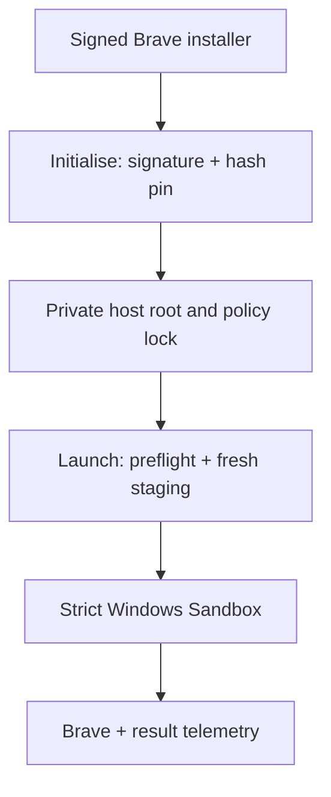

# Airlock Increment 1 Architecture

## Problem and success criteria

The first useful slice must launch Brave in a disposable Windows environment while
preventing ambient host-file access and capture-device redirection. Success is not
"a window opened." It is all of the following on a supported target host:

1. preflight rejects every unsupported prerequisite with a recovery action;
2. one launch creates exactly one recorded Sandbox ID;
3. generated XML explicitly disables network, audio, video, clipboard, printer, and
   vGPU, enables ProtectedClient, and bounds memory;
4. only a fresh read-only bootstrap and empty result folder are mapped;
5. Brave executes only after its signature and pinned hash are rechecked in the guest;
6. live acceptance and three-run resource evidence pass.

## AI decision

No AI or machine-learning component is needed. This is deterministic policy enforcement:
native rules are cheaper, faster, explainable, and testable. An AI agent in the launch
path would add nondeterminism, latency, data exposure, and another attack surface without
improving a binary allow/deny decision.

The baseline is unconfigured Windows Sandbox. Microsoft documents that its defaults
enable networking, microphone input, and clipboard redirection. Airlock replaces those
defaults with explicit denies and refuses an incomplete policy.

## Components and data flow



| Component | Responsibility | Trust rule |
|---|---|---|
| `Initialize-Airlock.ps1` | Validate publisher, hash installer, pin package and guest-script hashes | Never downloads or executes the installer |
| `Start-Airlock.ps1` | Preflight, single-launch mutex, hash recheck, staging, `wsb.exe` start, session record | Starts nothing after any ambiguous check |
| `New-AirlockProfile.ps1` | Validate strict policy and safe paths; render escaped XML | Rejects weakened values and broad/reparse mappings |
| `guest/provision.ps1` | Recheck signature/hash, install Brave, launch it, emit bounded result JSON | Reads only bootstrap; writes only result folder |
| `policy.json` | Reviewable strict template | Package fields stay unusable until signed initialisation |

There is no database, HTTP API, cloud service, authentication system, or web UI in this
local slice. The PowerShell commands are the user interface, JSON is the local contract,
and `wsb.exe` is the native platform API. Adding server layers would not solve a current
requirement.

## Host layout

```text
%LOCALAPPDATA%\Airlock\
  packages\<sha256>\BraveBrowserStandaloneSilentSetup.exe
  policy.lock.json
  sessions\<random-session-key>\
    Airlock.wsb
    bootstrap\        # mapped read-only; exactly three verified inputs
    result\           # mapped writable; empty at launch; JSON result only
  state\active-session.json   # never mapped
  evidence\increment-1-benchmark.json   # never mapped
```

The repository and Downloads directory are never mapped. A new session key prevents
cross-session guest writes from becoming executable input. The writable result mapping
is still untrusted data and is never executed.

## Policy schema

| Section | Important fields | Validation |
|---|---|---|
| `sandbox` | memory and seven explicit capability values | strict exact values; memory 2048–4096 MB binding ceiling |
| `package` | filename, publisher, SHA-256, version, relative package path | safe filename, valid signature, 64 uppercase hex, path under Airlock root |
| `guest` | provisioner filename/hash and result filename | safe names and pinned provisioner hash |

The 4096 MB template value is a launch configuration, not an approved performance
budget. OQ-10 remains open until the three-run baseline produces target-host evidence.

## Security boundary

| Control | Strength | Residual risk |
|---|---|---|
| Hypervisor-backed disposable guest | HARD, assuming supported Windows and enabled virtualisation | Windows or hypervisor vulnerabilities remain platform risk |
| Disabled microphone, camera, clipboard, printer, vGPU, network | HARD configuration for this session | ProtectedClient compatibility still needs target-host proof |
| Read-only staged bootstrap with repeated hash/signature checks | HARD against guest modification of executable input | A compromised host/user can replace Airlock itself |
| Empty per-session writable result folder | Narrow host write surface | Malicious guest can emit false/large data; host treats it as untrusted telemetry |
| Host session/audit state never mapped | HARD mapping rule | A compromised host can alter its own records |
| Provisioning telemetry | SOFT | Guest controls its own report; live negative controls remain required |

Secrets and persistent profiles are intentionally absent. Increment 1 creates no guest
credential persistence and no host data broker.

## Alternatives and trade-offs

| Approach | Decision | Reason |
|---|---|---|
| Native Windows Sandbox | Chosen | Smallest platform-native disposable boundary and native 24H2 lifecycle CLI |
| Full VM | Rejected for MVP | Stronger configurability but larger disk/RAM, patching, and operational burden |
| Docker/WSL2 | Rejected for GUI slice | Does not provide the required Windows desktop app boundary |
| Custom hypervisor or kernel driver | Rejected | Security-critical complexity duplicates the operating system |
| Online bootstrap | Rejected | Mutable supply-chain input and LAN exposure during the first security proof |
| Bundled installer binary | Rejected | Repository bloat, redistribution/provenance issues, and stale packages |

Software licence cost is zero beyond Windows and Brave. Actual RAM, disk, and launch
latency are unknown until `Measure-Increment1.ps1` runs on the target machine; no estimate
is presented as a benchmark.

## Failure, monitoring, and rollback

- Every host failure is terminating and occurs before `wsb start` where possible.
- Session ID, policy hash, installer hash, security posture, timestamps, and guest result
  are machine-readable; secrets are excluded.
- A mismatched package or changed provisioning script requires explicit reinitialisation.
- `wsb stop --id <sandbox-id>` terminates a live guest. Removing the private Airlock root
  later resets local packages and evidence, but that data-loss action is not automated in
  this increment.
- Versioned policy locks and immutable package hashes are the update/rollback mechanism.

## Known limitations

- The source has not yet run in this Linux workspace's absent Windows Sandbox runtime.
- ProtectedClient plus both mappings needs the OQ-04 Windows compatibility spike.
- Networking is off, so Brave cannot browse yet.
- The result share has no native quota; disk-exhaustion testing belongs in live review.
- Windows Sandbox CLI output shape is handled defensively, but target build behavior must
  be captured before DONE.
